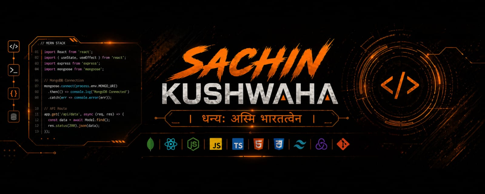

 

<picture style="display: block; border-radius: 16px; overflow: hidden; width: 96%;">
  
</picture>

 

धन्यः अस्मि भारतत्वेन

 

  

---

## 🛠️ Tech Stack

 

| **Core & Frontend** | **Backend & Tools** |
|:---:|:---:|
|  |  |

 

> **MERN Stack** — solid full-stack foundation &nbsp;|&nbsp; **TypeScript** — clean, reliable code &nbsp;|&nbsp; **Next.js** — modern React, production-ready

 

---

## ⚡ Live

[**ProDiligix**](https://www.prodiligix.com/) — B2B Procurement Platform &nbsp;·&nbsp; `React` `Vite` `Tailwind`

---

## GitHub Stats

 

&nbsp;&nbsp;

 

 

---

 

 

